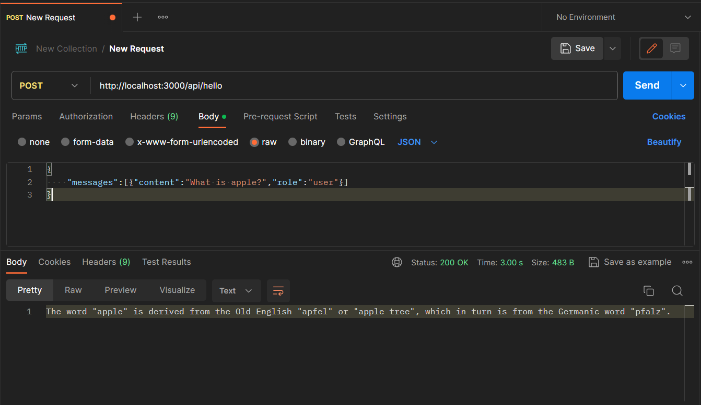

# Next.js Backend For AI Chat Extension

This project is a Next.js backend that provides an API for interacting with the Hugging Face API to generate text based on user messages. It's designed to work in conjunction with a frontend interface for creating chat-like interactions with a language model.

## Table of Contents

- [Getting Started](#getting-started)
  - [Prerequisites](#prerequisites)
  - [Installation](#installation)
- [Usage](#usage)
- [API Endpoints](#api-endpoints)
- [Error Handling](#error-handling)

## Getting Started

### Prerequisites

Before getting started, make sure you have the following installed:

- [Node.js](https://nodejs.org/) (v14 or later)
- [npm](https://www.npmjs.com/) or [Yarn](https://yarnpkg.com/) (recommended)

### Installation

1. Clone the repository:

   ```bash
   git clone https://github.com/ravix007/NextJS_Backend.git
   ```

2. Navigate to the project directory:

   ```bash
   cd NextJS_Backend
   ```

3. Install dependencies:

   ```bash
   npm install
   # or
   yarn install
   ```

4. Set up environment variables:

   Create a `.env` file in the project root and add your Hugging Face API key:

   ```
   HUGGINGFACE_API_KEY=your-api-key
   ```

5. Start the development server:

   ```bash
   npm run dev
   # or
   yarn dev
   ```

Your Next.js backend should now be running at `http://localhost:3000`.

## Usage

This backend provides API endpoints for text generation based on user messages. To use it, you'll need a frontend interface to interact with the API.

## API Endpoints

- `OPTIONS /api/chat`: This is used for handling HTTP OPTIONS requests and sets the necessary CORS headers.

- `POST /api/getRes`: This endpoint is used to submit user messages and receive text generation responses. It expects a JSON array of user messages. Example request:

  ```json
  {
    "messages":[{"content":"What is apple?","role":"user"}]
  }
  ```
  Screenshot!

  The endpoint will return a streaming response containing the generated text.

## Error Handling

The project includes basic error handling for common issues such as invalid input data or API errors. If an error occurs, the API will return an appropriate error response with an error message.

